# Сети в Linux

## Часть 1 Инструмент ipcalc

      - 1.1 Сети и маски
      - 1.2 localhost
      - 1.3 Диапазоны и сегменты сетей

### 1.1 Сети и маски

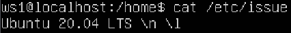

- Версия Ubuntu просле выполнения команды `cat /etc/issue` для ws1.
*************************************************************************************************************************
- Определение адреса сети 192.167.38.54/13: ipcalc 192.167.38.54/13
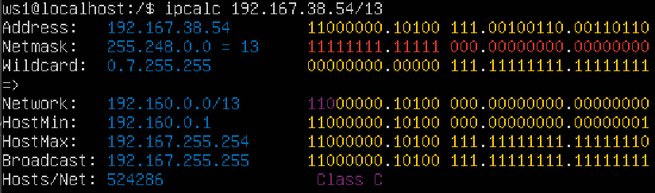

> Результат выполнения команды ipcalc 192.167.38.54/13
*************************************************************************************************************************
- Для перевода маски 255.255.255.0 в префиксную и двоичную запись выполним команду: ipcalc 255.255.255.0
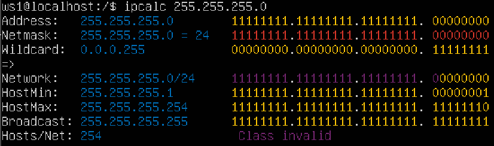

> Перевод маски 255.255.255.0 в префиксную и двоичную запись
*************************************************************************************************************************
- Для перевода /15 в обычную и двоичную запись выполним команду: ipcalc /15
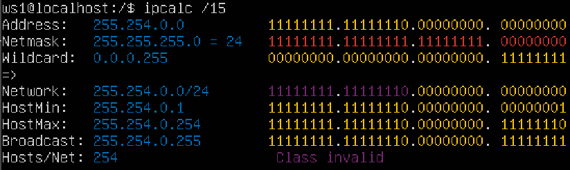

> Перевод маски /15 в обычную и двоичную запись
*************************************************************************************************************************
- Для перевода 11111111.11111111.11111111.11110000 в обычную и префиксную запись выполним команду: ipcalc 255.255.255.240
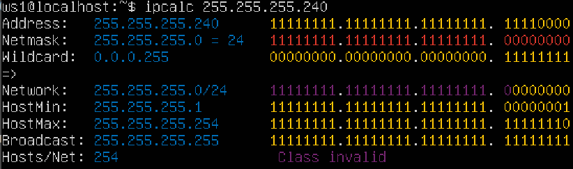

> Перевод 11111111.11111111.11111111.11110000 в обычную и префиксную запись
*************************************************************************************************************************
- Минимальный и максимальный хост в сети 12.167.38.4 при маске: /8
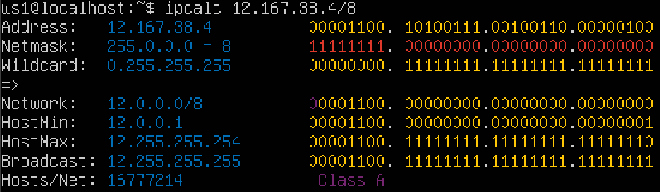

>Минимальный хост 12.0.0.1. Максимальный хост: 12.255.255.254
*************************************************************************************************************************
- Минимальный и максимальный хост в сети 12.167.38.4 при маске: 11111111.11111111.00000000.00000000
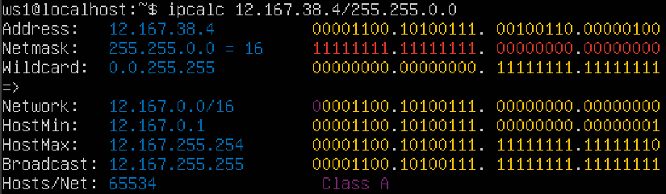

>Минимальный хост 12.0.0.1. Максимальный хост: 12.255.255.254
*************************************************************************************************************************
- Минимальный и максимальный хост в сети 12.167.38.4 при маске: 255.255.254.0
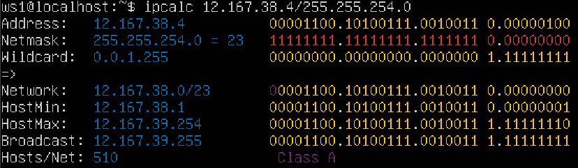

>Минимальный хост 12.167.38.1. Максимальный хост: 12.167.39.254
*************************************************************************************************************************
- Минимальный и максимальный хост в сети 12.167.38.4 при маске: /4
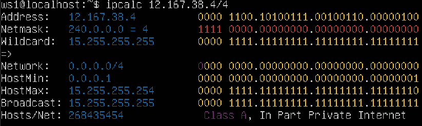

>Минимальный хост 0.0.0.1. Максимальный хост: 15.255.255.254
*************************************************************************************************************************

### 1.2 localhost

- Определяем, можно ли обратиться к приложению, работающему на localhost, со следующими IP: 194.34.23.100, 127.0.0.2, 127.1.0.1, 128.0.0.1 с помощью команды ping
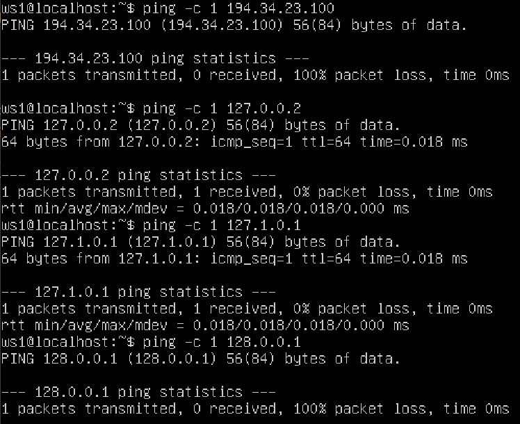

>Можно обратиться к 127.0.0.2 и 127.1.0.1. Пакеты с IP 194.34.23.100 и 128.0.0.1 - 100% packet loss
*************************************************************************************************************************

### 1.3 Диапазоны и сегменты сетей

- Определяем публичные и частные ip 10.0.0.45, 134.43.0.2, 192.168.4.2, 172.20.250.4, 172.0.2.1, 192.172.0.1, 172.68.0.2, 172.16.255.255, 10.10.10.10, 192.169.168.1 с помощью ipcalc
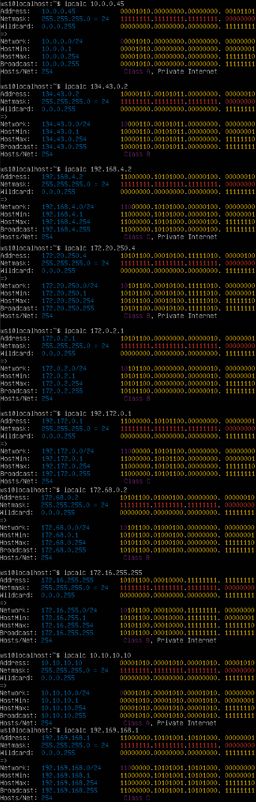

> Частные 10.0.0.45, 192.168.4.2, 172.20.250.4, 172.16.255.255, 10.10.10.10. Остальные публичные.
*************************************************************************************************************************
- Определим какие из перечисленных IP адресов шлюза возможны у сети 10.10.0.0/18: 10.0.0.1, 10.10.0.2, 10.10.10.10, 10.10.100.1, 10.10.1.255
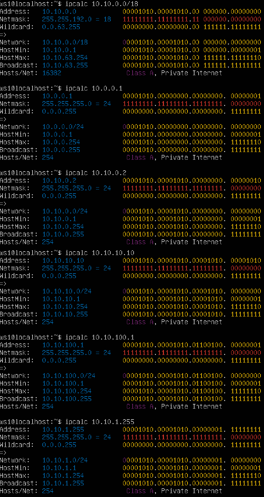

> Из перечисленных IP-адресов шлюза, только 10.10.0.2 и 10.10.1.255 возможны для сети 10.10.0.0/18. 10.0.0.1, 10.10.10.10 и 10.10.100.1 не входят в диапазон адресов данной сети. 
*************************************************************************************************************************

## Часть 2 Статическая маршрутизация между двумя машинами

      - 2.1 Добавление статического маршрута вручную
      - 2.2. Добавление статического маршрута с сохранением

- Создаём ws2.
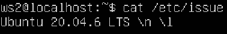

>Версия Ubuntu просле выполнения команды `cat /etc/issue` для ws2.
*************************************************************************************************************************
- Выполним ip -a для ws1 и ws2
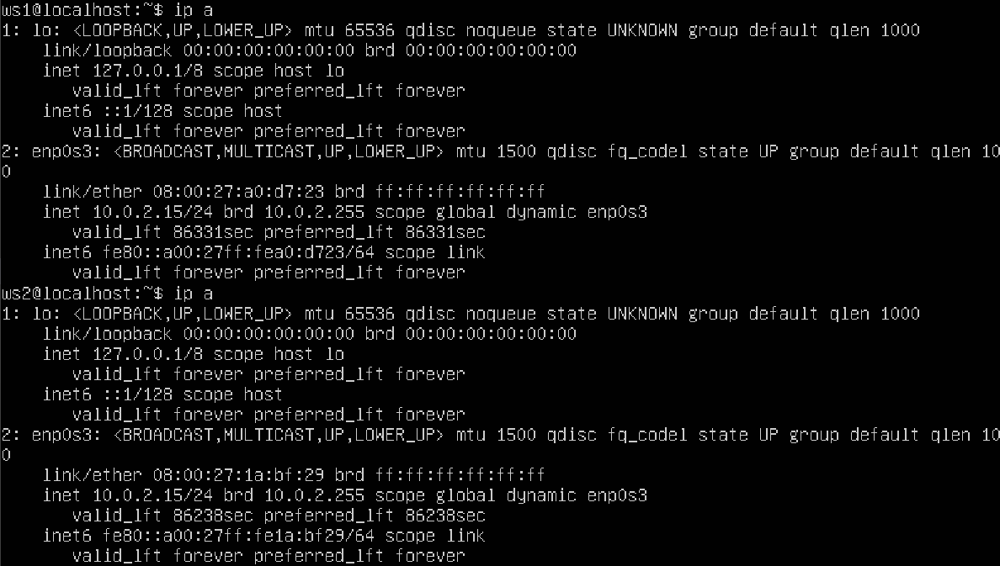
>Результат выполнения ip -a для ws1 и ws2
*************************************************************************************************************************
- Изменим файлы etc/netplan/00-installer-config.yaml, пропишем IP для ws1 и ws2 и выполним netplan apply для перезапуска сервиса сети
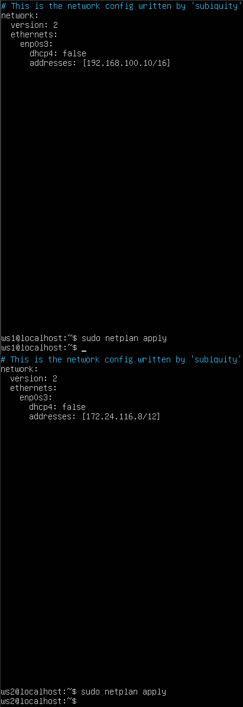

>Скрины с содержанием изменённого файла etc/netplan/00-installer-config.yaml для для ws1 и ws2 и выполненной команды netplan apply 
*************************************************************************************************************************

### 2.1. Добавление статического маршрута вручную
- Добавим статический маршрут от одной машины до другой и обратно при помощи команды вида ip r add
Пропингуем соединение между машинами

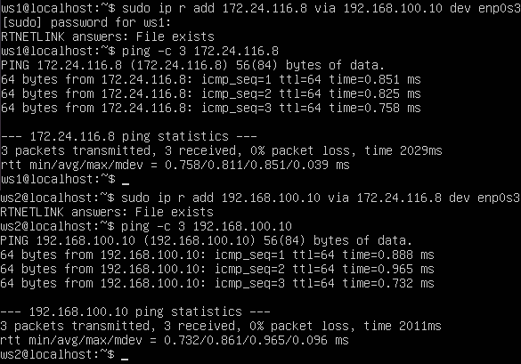

>Скрины ip r add и ping ws1->ws2 и ws2->ws1

### 2.2. Добавление статического маршрута с сохранением
- Добавим статический маршрут от одной машины до другой с помощью файла etc/netplan/00-installer-config.yaml и пропингуем

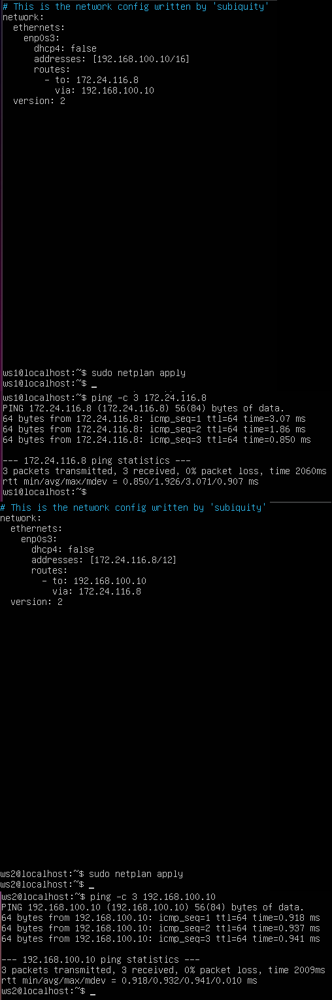

>Скрины добавления статических маршрутов и ping машин
Первое поле указывает, что мы настраиваем сеть, далее указывается версия YAML и рендер, т.е. какой сетевой менеджер будет использоваться, если эта опция не указана, то подразумевается networkd, хотя мы советуем указывать ее явно. Альтернативным значением является NetworkManager, обратите внимание на регистр написания.

Поле ethernets содержит настройки проводных интерфейсов, в качестве значений выступают поля с именами интерфейсов, которые содержат поля с настройками. Для включения DHCP по протоколу IPv4 используется опция dhcp4, в которой можно указать как true/false, так и yes/no.

Настройка статического IP-адреса.
В поле dchp4 прописываем значение false, так как мы не используем DHCP. Поле addresses подразумевает список значений, которые заключаются в квадратные скобки и перечисляются через запятую, скобки обязательны, даже если значение одно. (Также можно использовать и альтернативный вариант синтаксиса) Формат записи IP-адреса: адрес/префикс, префикс /24 соответствует маске 255.255.255.0.

Для указания шлюза служит поле gateway4, а для настройки DNS - nameservers, которое содержит вложенные поля, мы должны указать как минимум одно, с адресами DNS-серверов.

Если требуется указать несколько IP-адресов для одного интерфейса, то запись будет выглядеть так: addresses: [192.168.233.154/24, 192.168.1.154/24]  или addresses: - 192.168.233.154/24 - 192.168.1.154/24

## Часть 3 Утилита iperf3

      - 3.1 Скорость соединения
      - 3.2 Утилита iperf3

### 3.1 Скорость соединения
Консольная утилита iperf3 предназначена для того, чтобы измерять пропускную способность сети. Она поддерживает работу как по протоколу TCP, так и по UDP. Для проведения тестирования надо запустить iperf3 как на сервере, так и на клиенте. Клиентская часть будет генерировать трафик, а серверная - принимать и отбрасывать.

Переведём: 8 Mbps в MB/s, 100 MB/s в Kbps, 1 Gbps в Mbps
8 Mbps = 1 MB/s
100 MB/s = 819200 Kbps
1 Gbps = 1024 Mbps

### 3.2. Утилита iperf3
Измерим скорость соединения между ws1 и ws2

- Запустим с помощью команды iperf3 -s -D серверную часть утилиты iperf3 в фоновом режиме, проверим работу сервера ss -tulpn | grep 5201. Либо iperf3 -s.
- Запустим клиентскую части утилиты iperf3 -f K, по умолчанию тестирование идет 10 сек. Либо iperf3 -c 192.168.100.10
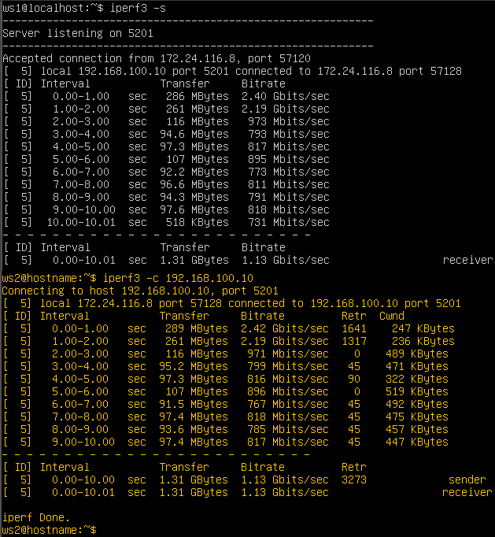

> Скрин работы клиент-серверной части ws1 ws2 с замером скорости сединения

## Часть 4 Сетевой экран

      - 4.1 Утилита iptables
      - 4.2 Утилита nmap

### 4.1 Утилита iptables
Утилита iptables служит для проверки сетевых пакетов. В фильтре iptables все пакеты делятся на три основные цепочки:

input - обрабатывает входящие пакеты и подключения
forward - применяется для проходящих соединений
output - используется для исходящих пакетов и соединений а также существуют две вспомогательные:
prerouting - в эту цепочку пакет попадает перед обработкой iptables, система еще не знает куда он будет отправлен, в input, output или forward;
postrouting - сюда попадают все проходящие пакеты, которые уже прошли цепочку forward.
Для каждого типа пакетов можно установить набор правил, которые по очереди будут проверяться на соответствие с пакетом и если пакет соответствует, то применять к нему указанное в правиле действие. Правила образуют цепочку, поэтому input, output и forward называют цепочками, цепочками правил. Действий может быть несколько:

ACCEPT - разрешить прохождение пакета дальше по цепочке правил;
DROP - удалить пакет;
REJECT - отклонить пакет, отправителю будет отправлено сообщение, что пакет был отклонен;
LOG - сделать запись о пакете в лог файл;
QUEUE - отправить пакет пользовательскому приложению.
Над цепочками правил в iptables есть еще один уровень абстракции, и это таблицы. В системе есть несколько таблиц, и все они имеют стандартный набор цепочек input, forward и output. Таблицы предназначены для выполнения разных действий над пакетами, например для модификации или фильтрации.

raw - предназначена для работы с сырыми пакетами, пока они еще не прошли обработку;
mangle - предназначена для модификации пакетов;
nat - обеспечивает работу nat, если вы хотите использовать компьютер в качестве маршрутизатора;
filter - основная таблица для фильтрации пакетов, используется по умолчанию.
Создать файл /etc/firewall.sh, имитирующий фаерволл, на ws1 и ws2 и добавить в него подряд следующие правила:
-на ws1 применить стратегию когда в начале пишется запрещающее правило, а в конце пишется разрешающее правило (это касается пунктов 4 и 5)
-на ws2 применить стратегию когда в начале пишется разрешающее правило, а в конце пишется запрещающее правило (это касается пунктов 4 и 5)
открыть на машинах доступ для порта 22 (ssh) и порта 80 (http)
запретить echo reply (машина не должна "пинговаться”, т.е. должна быть блокировка на OUTPUT)
разрешить echo reply (машина должна "пинговаться")
Запустить файлы на обеих машинах командами chmod +x /etc/firewall.sh и /etc/firewall.sh
В отчёт поместить скрины с запуском обоих файлов и с содержанием файла /etc/firewall для каждой машины.
*************************************************************************************************************************
Содержание файлов /etc/firewall.sh + chmod +x /etc/firewall.sh запуск /etc/firewall.sh и ping между машинами ws1 и ws2

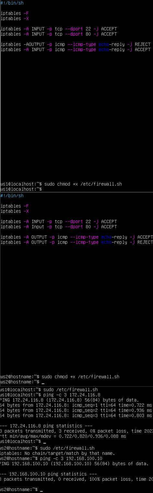

> Создание firewall.sh, запуск и ping машин друг с другом

Так как утилита iptabels выполняет первое прочитанное правило, разница между стратегиями заключается в порядке команд. Для машины ws1 первой стоит команда REJECT - отклонить пакет. Будет выполнятся этот запрет и пинг не пройдет. Для машины ws2 напротив, первым стоит ACCEPT - разрешить прохождение пакета. Пинг проходит.

### 4.2 Утилита nmap

Командой ping найдём машину, которая не "пингуется", после чего утилитой nmap посмотрим, что хост машины запущен
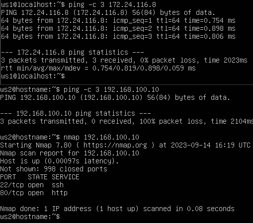

> Пингуем ws1 и ws2. На ws2 пинг не проходит, выполняем nmap для ws2
*************************************************************************************************************************
Сохраним дампы образов виртуальных машин
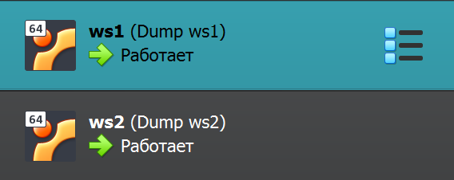

> Снимки машин ws1 и ws2

## Часть 5 Статическая маршрутизация сети

      - 5.1 Настройка адресов машин
      - 5.2 Включение переадресации IP-адресов
      - 5.3 Установка маршрута по-умолчанию
      - 5.4 Добавление статических маршрутов
      - 5.5 Построение списка маршрутизаторов
      - 5.6 Использование протокола ICMP при маршрутизации

### 5.1 Настройка адресов машин

Настроим конфигурации машин в etc/netplan/00-installer-config.yaml согласно сети на рисунке.

> Требуемая конфигурация
*************************************************************************************************************************
Отредактируем содержание файлов etc/netplan/00-installer-config.yaml для каждой машины.
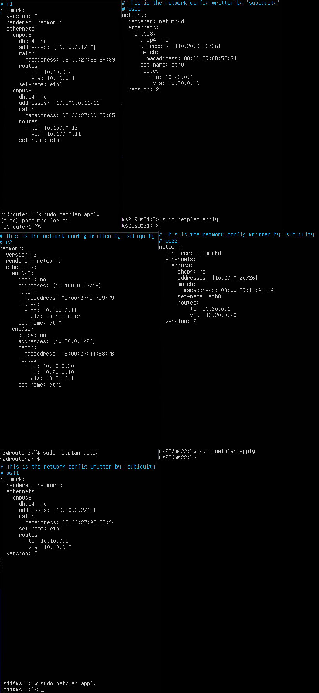

> Содержание файлов etc/netplan/00-installer-config.yaml и результаты выполнения команды sudo netplan apply для всех устройств
*************************************************************************************************************************
Командой ip -4 a проверим, что адреса машин заданы верно. Также пропингуем ws22 с ws21. Аналогично пропингуем r1 с ws11.
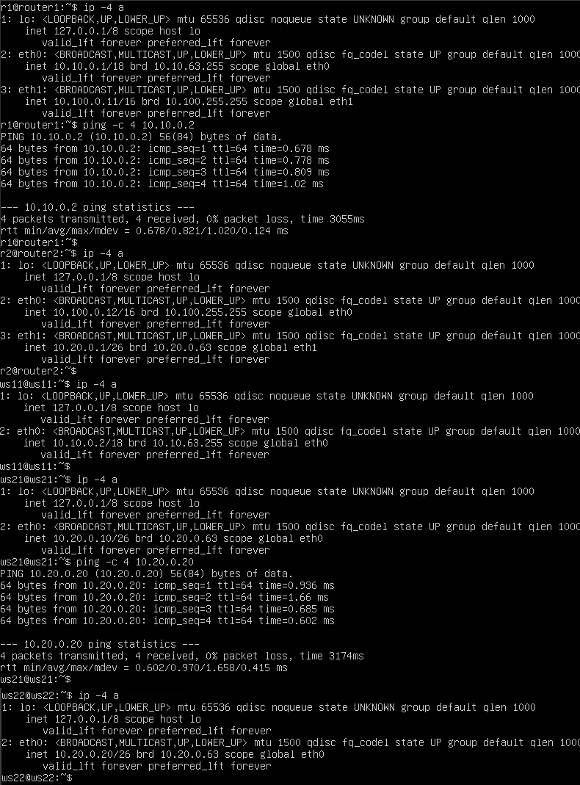

> Результаты команд ip -4 a и пинга машин

### 5.2 Включение переадресации IP-адресов

Для включения переадресации IP, выполним команду на роутерах: sysctl -w net.ipv4.ip_forward=1
При таком подходе переадресация не будет работать после перезагрузки системы.
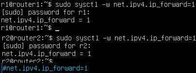

> Результаты команд sysctl -w net.ipv4.ip_forward=1 на роутерах и фрагмент файла /etc/sysctl.conf с подтверждением того, что команда не приминилась.
*************************************************************************************************************************
Откроем файлы /etc/sysctl.conf и раскомментируем строки:
net.ipv4.ip_forward = 1
При использовании этого подхода, IP-переадресация включится на постоянной основе.
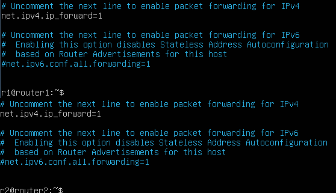

> Скрины раскомментированных строк net.ipv4.ip_forward=1 для роутеров

### 5.3 Установка маршрута по-умолчанию

Настроим маршруты по-умолчанию (шлюз) для рабочих станций. Для этого добавим default перед IP роутера в файлах конфигураций.
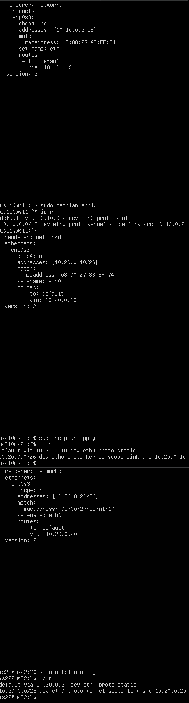

> Скрины с содержанием файлов etc/netplan/00-installer-config.yaml, вызовом ip r и посмотрим, что добавился маршрут в таблицу маршрутизации
*************************************************************************************************************************
Пропингуем с ws11 роутер r2 и посмотрим на r2, что пинг доходит. Для этого используем команду:
tcpdump -tn -i eth1 на r2
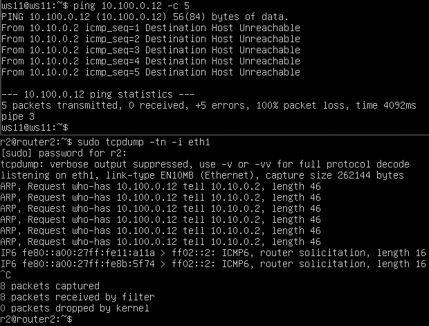

> Скрины пинга ws11->r2 с использованием команды tcpdump -tn -i eth1

### 5.4 Добавление статических маршрутов

Добавим в роутеры r1 и r2 статические маршруты в файле конфигураций etc/netplan/00-installer-config.yaml. Вызовем ip r и посмотрим таблицы с маршрутами на обоих роутерах. 
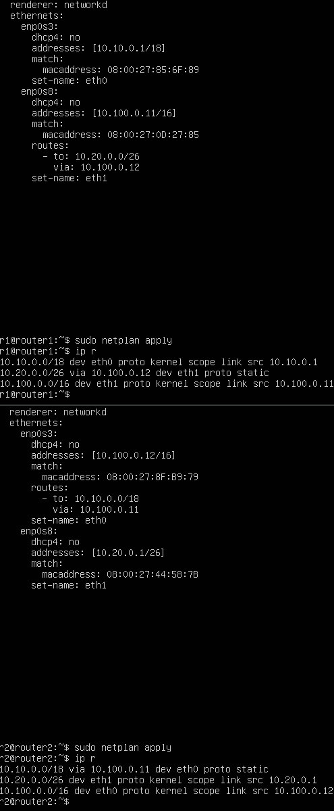

> Скрины статических маршрутов в файлах конфигураций r1 и r1 и вызов ip r
*************************************************************************************************************************
Запустим команды на ws11:
ip r list 10.10.0.0/[маска сети] и ip r list 0.0.0.0/0
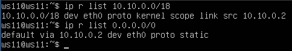

> Команды ip r list 10.10.0.0/[маска сети] и ip r list 0.0.0.0/0 выполненные на ws11
При наличии двух и более маршрутов выбирается маршрут с самой длинной маской т.к. он более точный

### 5.5 Построение списка маршрутизаторов

Запустим на r1 команду дампа: tcpdump -tnv -i eth0
При помощи утилиты traceroute построим список маршрутизаторов на пути от ws11 до ws21
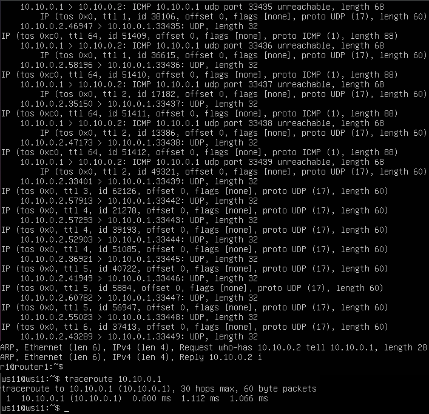

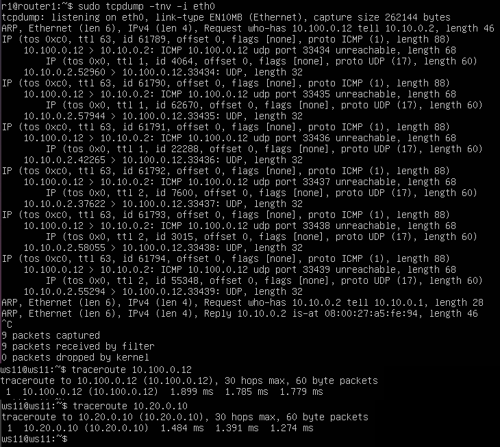

> Выполнение команды traceroute до хостов 10.10.0.1, 10.100.0.12, 10.20.0.10 с ws11 с замером дампа с r1 

Каждый пакет проходит на своем пути определенное количество узлов, пока достигнет своей цели. Причем, каждый пакет имеет свое время жизни. Это количество узлов, которые может пройти пакет перед тем, как он будет уничтожен. Этот параметр записывается в заголовке TTL, каждый маршрутизатор, через который будет проходить пакет уменьшает его на единицу. При TTL=0 пакет уничтожается, а отправителю отсылается сообщение Time Exceeded. Команда traceroute linux использует UDP пакеты. Она отправляет пакет с TTL=1 и смотрит адрес ответившего узла, дальше TTL=2, TTL=3 и так пока не достигнет цели. Каждый раз отправляется по три пакета и для каждого из них измеряется время прохождения. Пакет отправляется на случайный порт, который, скорее всего, не занят. Когда утилита traceroute получает сообщение от целевого узла о том, что порт недоступен трассировка считается завершенной.

### 5.6 Использование протокола ICMP при маршрутизации

Запустим на r1 перехват сетевого трафика, проходящего через eth0 с помощью команды:
tcpdump -n -i eth0 icmp
Пропингуем с ws11 несуществующий IP (например, 10.30.0.111) с помощью команды:
ping -c 1 10.30.0.111
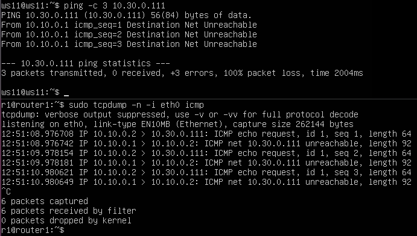

> Выполнение команды ping -c 3 10.30.0.111 с перехватом трафика

## Часть 6 Динамическая настройка IP с помощью DHCP

Для r2 настроим в файле /etc/dhcp/dhcpd.conf конфигурацию службы DHCP:
1) укажем адрес маршрутизатора по-умолчанию, DNS-сервер и адрес внутренней сети
2) в файле /etc/resolv.conf пропишем nameserver 8.8.8.8.
3) Перезагрузим службу DHCP командой systemctl restart isc-dhcp-server. 
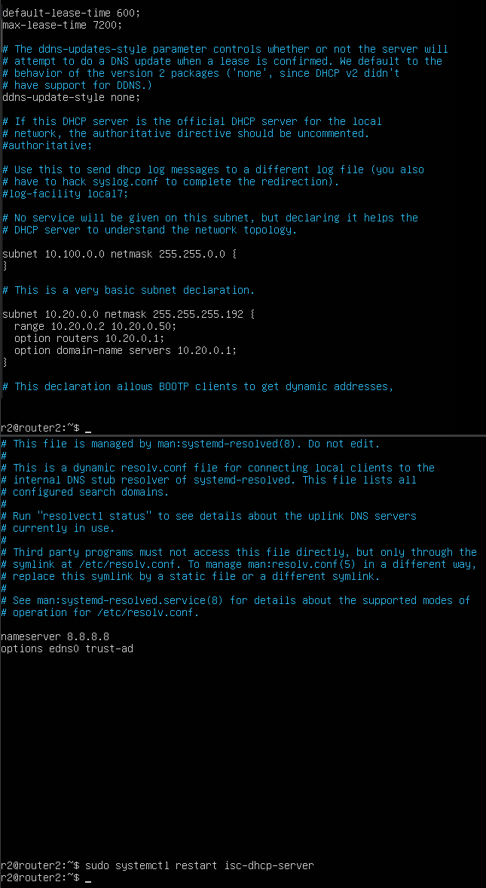

> В r2 настройка /etc/dhcp/dhcpd.conf конфигурации. /etc/resolv.conf -> nameserver 8.8.8.8. Выполненим systemctl restart isc-dhcp-server
*************************************************************************************************************************
Машину ws21 перезагрузим при помощи reboot и через ip a покажем, что она получила адрес. Также пропингуем ws22 с ws21.
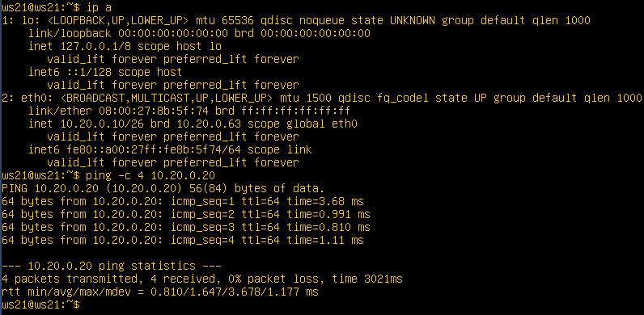

>  reboot ws21 -> ip a -> ping 10.20.0.10 из ws21. IP ws21 - 10.20.0.63
*************************************************************************************************************************
Указажем/изменим MAC адрес у ws11, для этого в etc/netplan/00-installer-config.yaml добавим (изменим) строки: macaddress: 10:10:10:10:10:BA, dhcp4: true
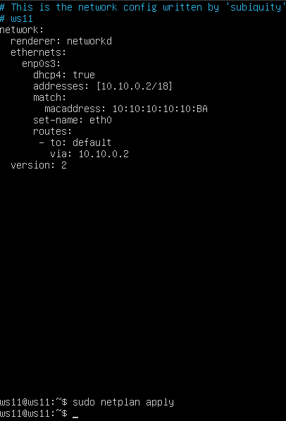

> ws11 изменение/добавление macaddress, dhcp4 в etc/netplan/00-installer-config.yaml
*************************************************************************************************************************
Для r1 настроим в файле /etc/dhcp/dhcpd.conf конфигурацию службы DHCP:
1) укажем адрес маршрутизатора по-умолчанию, DNS-сервер и адрес внутренней сети
2) в файле /etc/resolv.conf пропишем nameserver 8.8.8.8.
3) Перезагрузим службу DHCP командой systemctl restart isc-dhcp-server. 
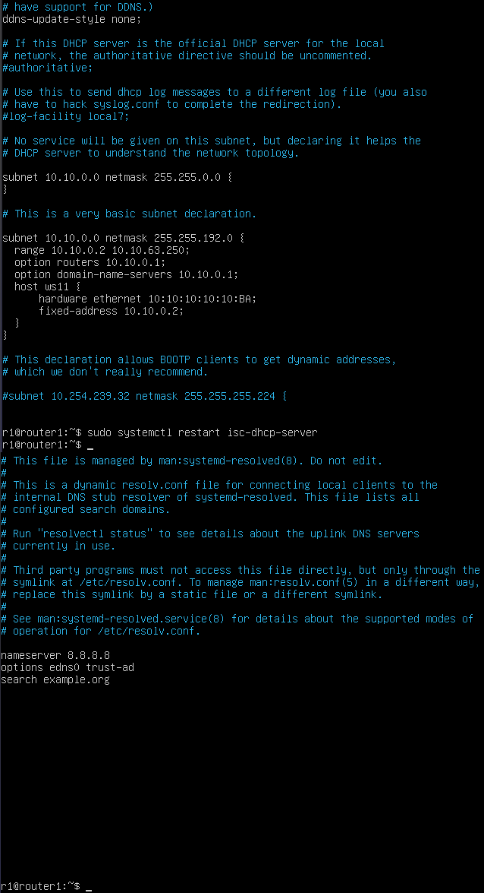

> В r1 настройка /etc/dhcp/dhcpd.conf конфигурации. /etc/resolv.conf -> nameserver 8.8.8.8. Выполненим systemctl restart isc-dhcp-server
*************************************************************************************************************************
Машину ws11 перезагрузим при помощи reboot и через ip a покажем, что она получила адрес. Также пропингуем ws22 с ws11.
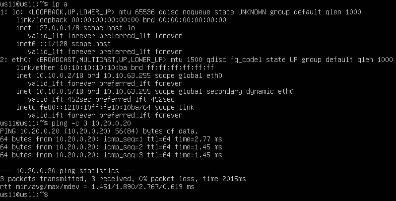

>  reboot ws11 -> ip a -> ping ws22 из ws11.
*************************************************************************************************************************
Указажем/изменим MAC адрес у ws11, для этого в etc/netplan/00-installer-config.yaml добавим (изменим) строки: macaddress: 10:10:10:10:10:BA, dhcp4: true
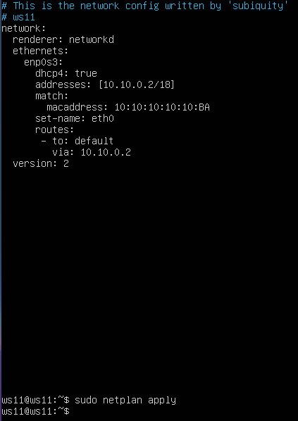

> ws11 изменение/добавление macaddress, dhcp4 в etc/netplan/00-installer-config.yaml
*************************************************************************************************************************
Вызовем ip a для просмотра текущего IP. Поправим для ws21 файлы /etc/dhcp/dhcpd.conf, /etc/resolv.conf для настройки получения динамического IP машиной. Выполним команду dhclient -v для запроса нового IP. 
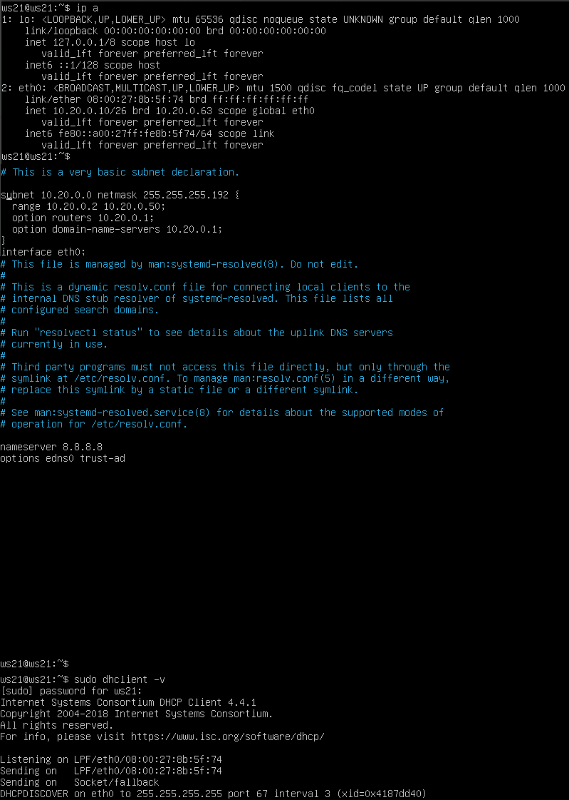

> ws21: ip a -> /etc/dhcp/dhcpd.conf -> /etc/resolv -> dhclient -v

Сохраним дампы образов виртуальных машин.
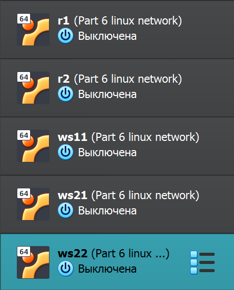

> Дампы машин -> Part 6 linux network

## Часть 7 NAT

В файлах /etc/apache2/ports.conf на ws22 и r1 изменим строку Listen 80 на Listen 0.0.0.0:80, то есть сделаем сервер Apache2 общедоступным
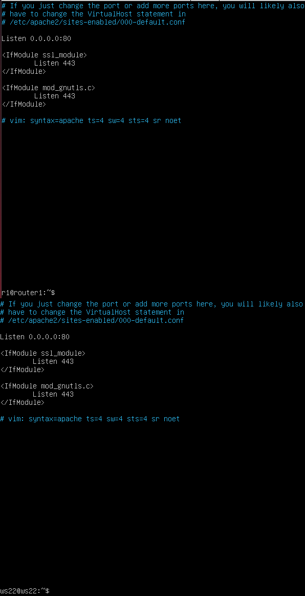

> ws22, r1 -> /etc/apache2/ports.conf -> Listen 0.0.0.0:80
*************************************************************************************************************************
Запустим веб-серверы Apache командой service apache2 start на ws22 и r1
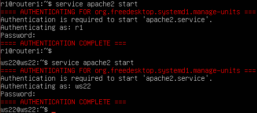

> ws22, r1 -> service apache2 start
*************************************************************************************************************************
Добавим в фаервол, созданный по аналогии с фаерволом из Части 4, на r2 следующие правила:
1) удаление правил в таблице filter - iptables -F
2) удаление правил в таблице "NAT" - iptables -F -t nat
3) отбрасывать все маршрутизируемые пакеты - iptables --policy FORWARD DROP
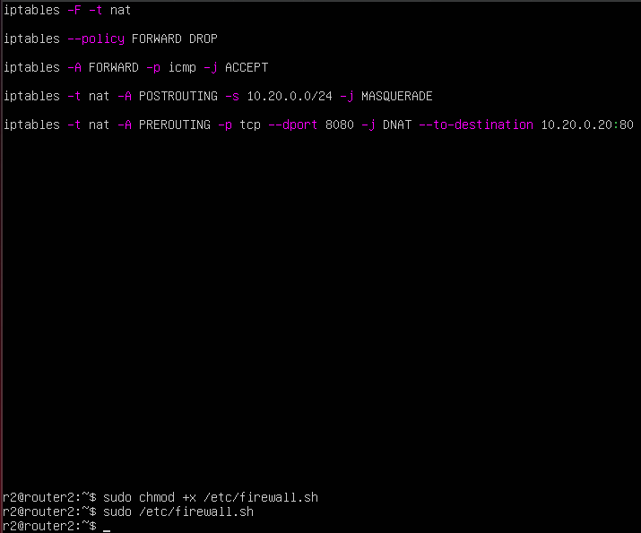

> r2 -> iptables -F -> iptables -F -t nat -> iptables --policy FORWARD DROP -> iptables -A FORWARD -p icmp -j ACCEPT -> iptables -t nat -A POSTROUTING -s 10.20.0.0/24 -j MASQUERADE -> iptables -t nat -A PREROUTING -p tcp --dport 8080 -j DNAT --to-destination ws22_ip:80
*************************************************************************************************************************
Проверим соединение между ws22 и r1 командой ping
При запуске файла с этими правилами, ws22 не должна "пинговаться" с r1
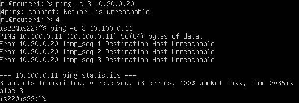

> ws22, r1 ping
*************************************************************************************************************************
Разрешим маршрутизацию всех пакетов протокола ICMP
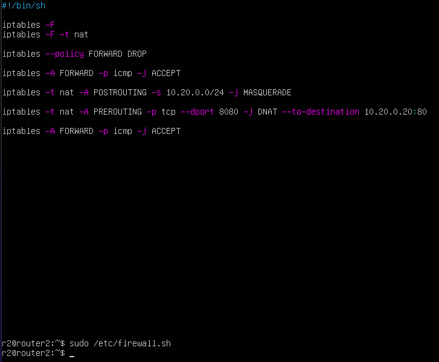

> r2 -> /etc/firewall.sh -> iptables -A FORWARD -p icmp -j ACCEPT
*************************************************************************************************************************
Проверим соединение между ws22 и r1 командой ping
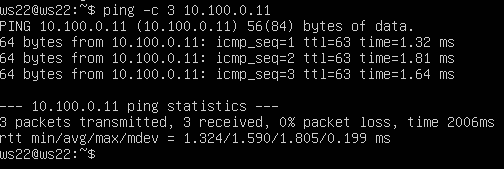

> ws22 -> r1 -> ping -c 3 10.100.0.11
*************************************************************************************************************************
Добавим в файл ещё два правила:
- включим SNAT, а именно маскирование всех локальных ip из локальной сети, находящейся за r2 (по обозначениям из Части 5 - сеть 10.20.0.0)
- включим DNAT на 8080 порт машины r2 и добавить к веб-серверу Apache, запущенному на ws22, доступ извне сети
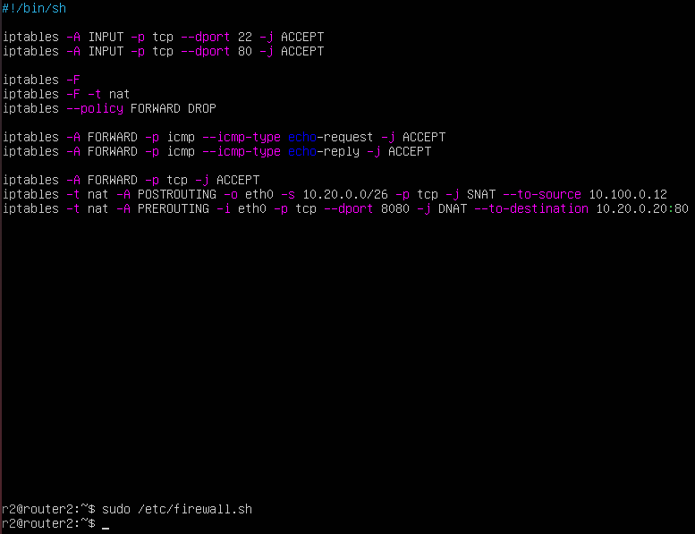

> r2-> /etc/firewall.sh -> add SNAT, DNAT
*************************************************************************************************************************
Проверим соединение по TCP для SNAT, для этого с ws22 подключимся к серверу Apache на r1
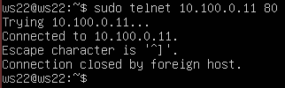

> ws22 -> r1 -> telnet 10.100.0.11 80
*************************************************************************************************************************
Проверим соединение по TCP для DNAT, для этого с r1 подключимся к серверу Apache на ws22 командой telnet (по адресу r2 и порту 8080)
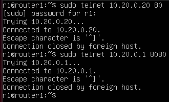

> r1 -> r2:8080 -> ws22
*************************************************************************************************************************
Сохраним дампы образов виртуальных машин
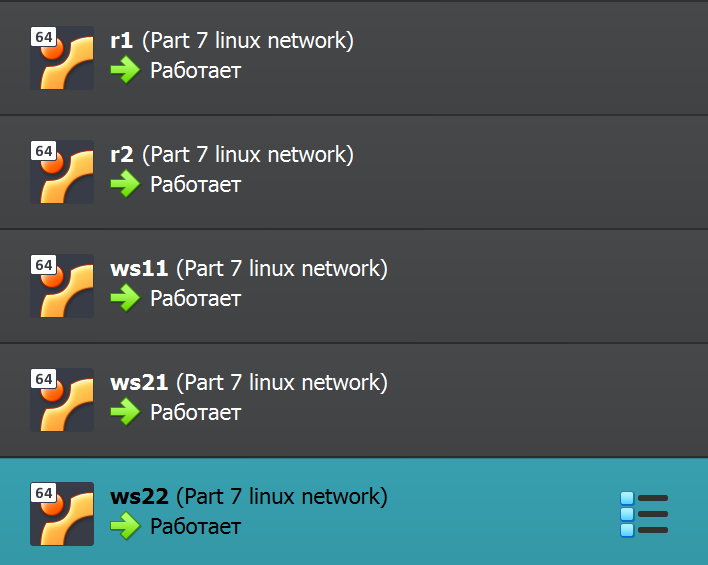

> Part 7 linux network

## Часть 8 Дополнительно. Знакомство с SSH Tunnels

Запустим на r2 фаервол с правилами из Части 7
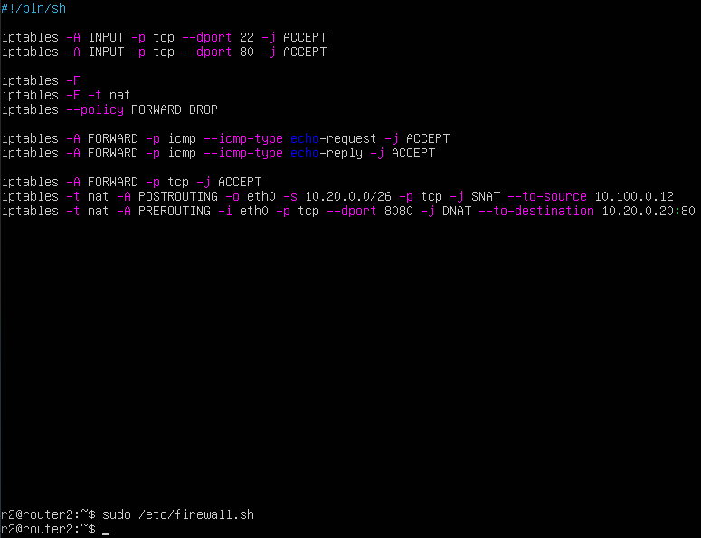

> r2 -> /etc/firewall.sh
*************************************************************************************************************************
Запустим веб-сервер Apache на ws22 только на localhost (то есть в файле /etc/apache2/ports.conf изменим строку Listen 80 на Listen localhost:80)
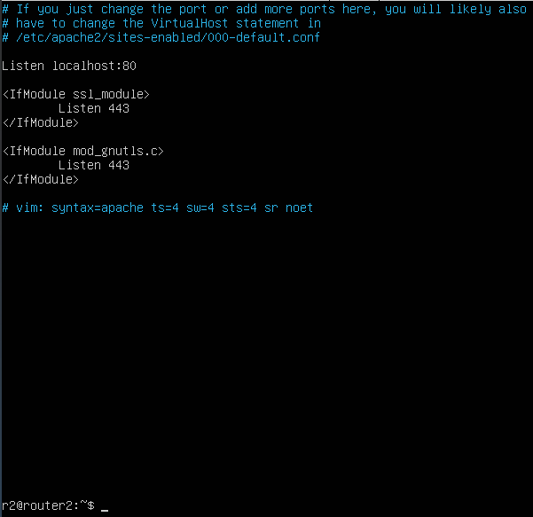

> r2 -> /etc/apache2/ports.conf -> Listen localhost:80
*************************************************************************************************************************
Воспользуемся Local TCP forwarding с ws21 до ws22, чтобы получить доступ к веб-серверу на ws22 с ws21. 
ssh -L [local_port]:localhost:80 [remote_ip]
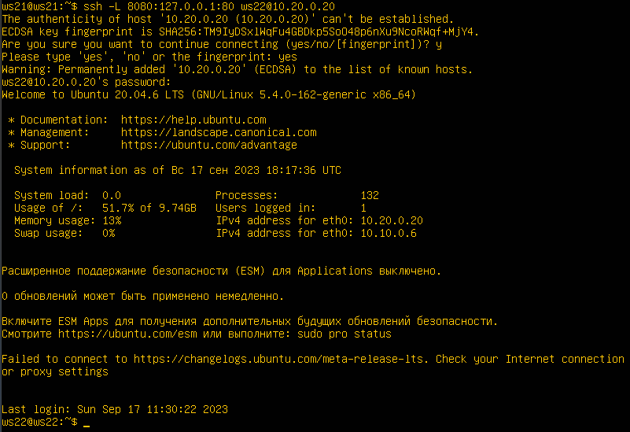

> ws21 -> ssh -L 8080:127.0.0.1:80 ws22@10.20.0.20 -> yes -> pin code ws22 -> ws22
Для выхода необходимо набрать EXIT в терминале
*************************************************************************************************************************
Воспользуемся Remote TCP forwarding c ws11 до ws22, чтобы получить доступ к веб-серверу на ws22 с ws11
ssh -R [remote_port]:localhost:80 [remote_ip]
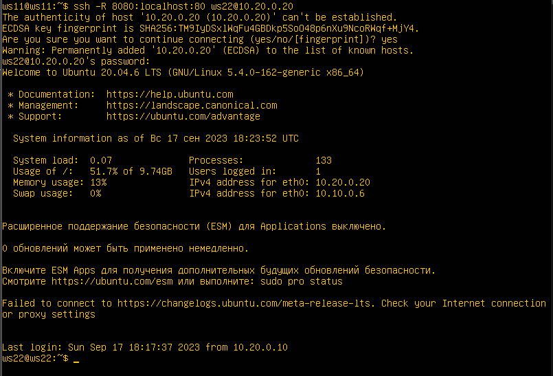

> ws11 -> ssh -R 8080:127.0.0.1:localhost:80 ws22@10.20.0.20 -> yes -> pin code ws22 -> ws22
Для выхода необходимо набрать EXIT в терминале
*************************************************************************************************************************
Для проверки, сработало ли подключение в обоих предыдущих пунктах, перейдем во второй терминал клавишами Alt + F2 и выполним команду:
telnet 127.0.0.1 80
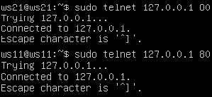

> ws21 -> alt+F2 -> telnet 127.0.0.1 80; ws11 -> alt+F2 -> telnet 127.0.0.1 80
*************************************************************************************************************************
Сохраним дампы образов виртуальных машин
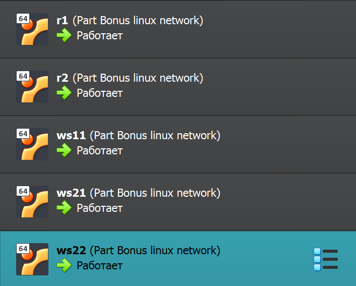
